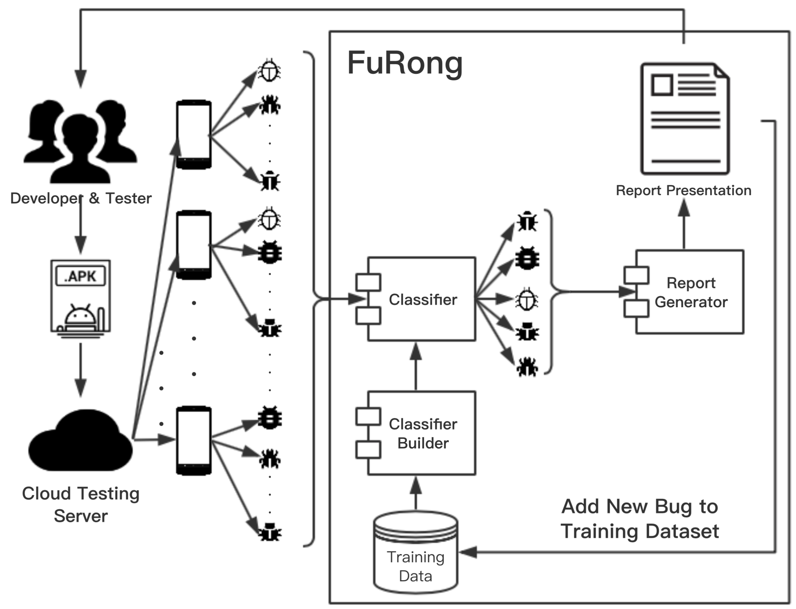

# FuRong

## The vedio of the tool can be seen at: https://youtu.be/acmSsjZRXXE.

## Fusing Report of Automated Android Testing on Multi-Devices

Automated testing has been widely used to ensure the quality of Android applications. However, incomprehensible results make it difficult for developers to understand and fix bugs via automated testing. This paper proposes a tool, namely FuRong, to fuse high-readability and strong-guiding-ability bug reports via analyzing the information from automated testing on multi-devices. FuRong builds a bug model with complete context information, such as screen-shoots, execution events and logs from multi-devices, which are significant for developers, and then inducts a classification rule for bugs, which is the foundation for bug classification and deduplication. FuRong classifies bugs and removes some redundant bug information. FuRong also recommends a possible fixing solution for each type of bug. An empirical study of 8 open source Android applications with automated testing on 20 devices has been conducted. The preliminary results show the effectiveness of FuRong with the average accuracy of 93%.

