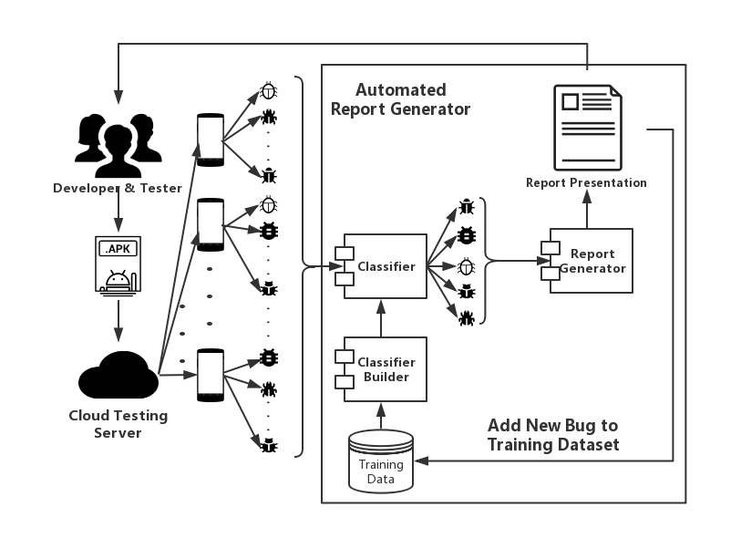

# ABR
## Assembling Bug Report of Automated Android Testing on Multi-Devices

Automated testing has been widely used to ensure the quality of Android applications. Incomprehensible results make automated testing difficult for developers to understand and fix bugs. Consequently, it reduces the effectiveness of quality assurance. This paper proposes a tool, namely ABR, to assemble some comprehensible bug reports via analyzing the information of automated testing on multi-devices. Logs from multi-devices are significant for developers to understand and fix bugs. ABR builds a bug model with complete context information, and then classifies bugs and remove some redundant bug information. ABR also recommends a possible fixing solution for each type of bug. We first induct a classification rule for bugs, which is the foundation for bug classification and deduplication. An empirical study of 8 open source Android applications with automated testing on 20 devices has been conducted. The bug reports produced by ABR are verified by some testers manually. The average accuracy of comprehensible bug reports reached 93%. The preliminary results show the effectiveness of ABR.

## The vedio of the tool can be seen at: https://youtu.be/hALyNN4shBg.

